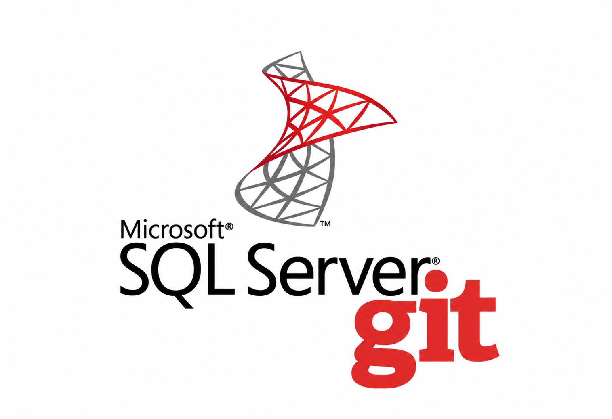
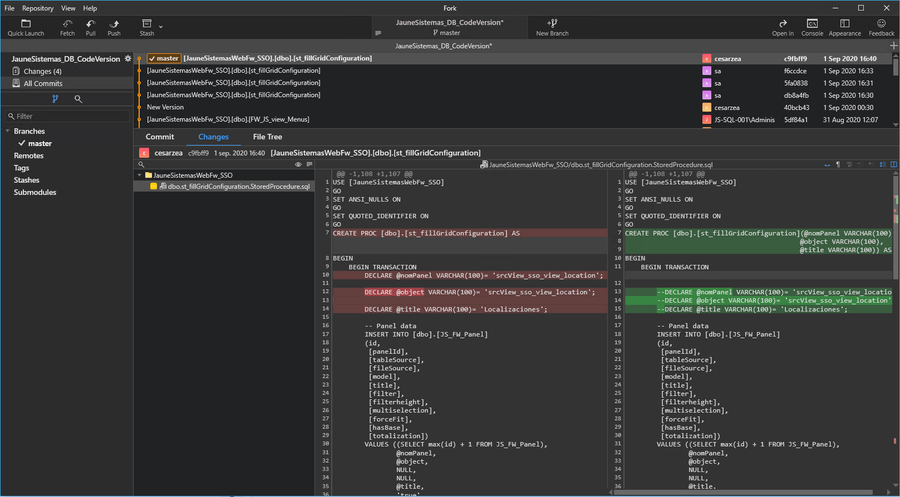
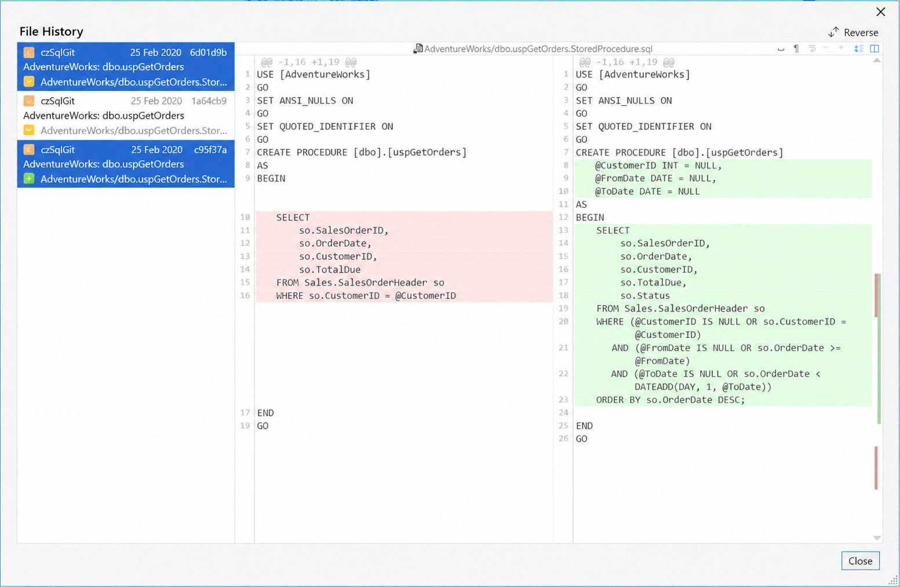
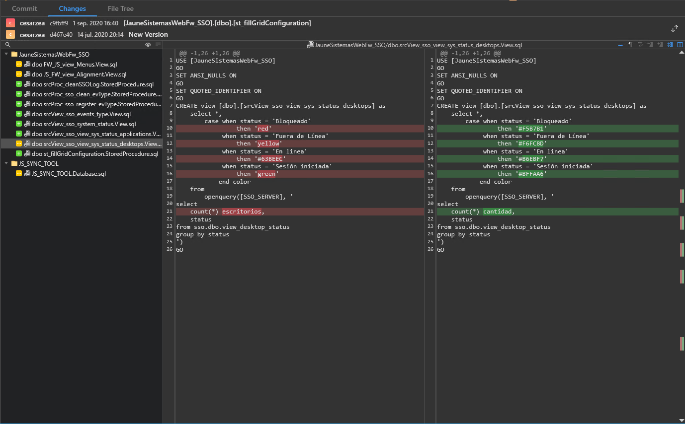
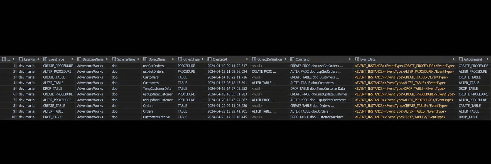
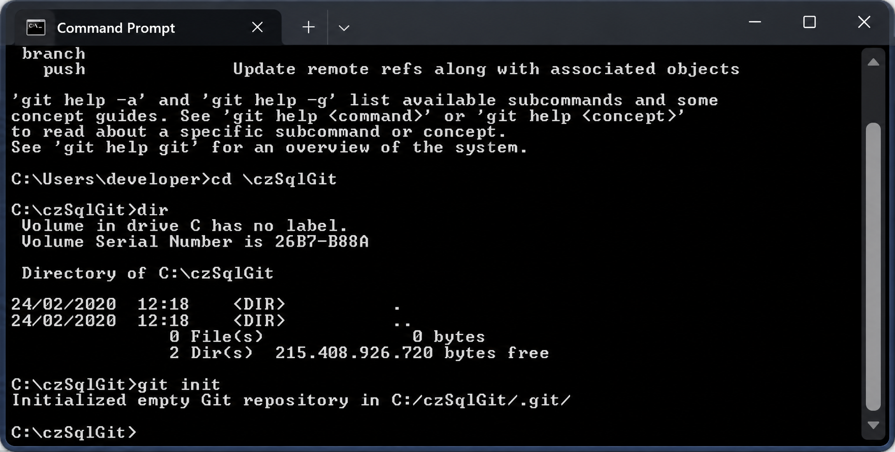
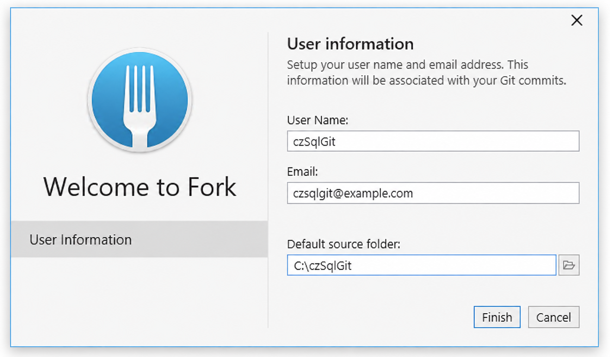
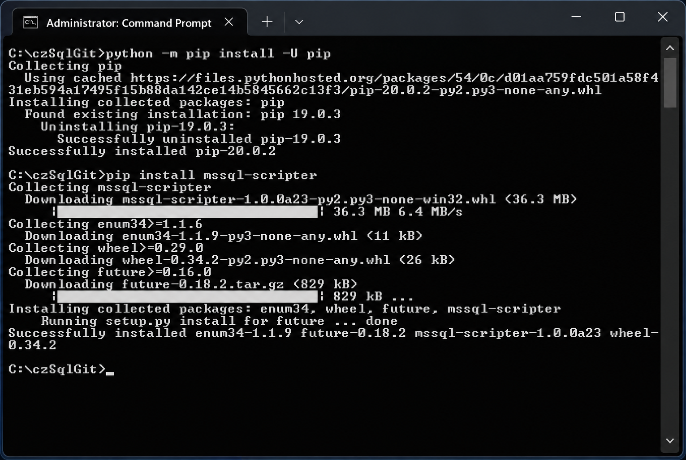
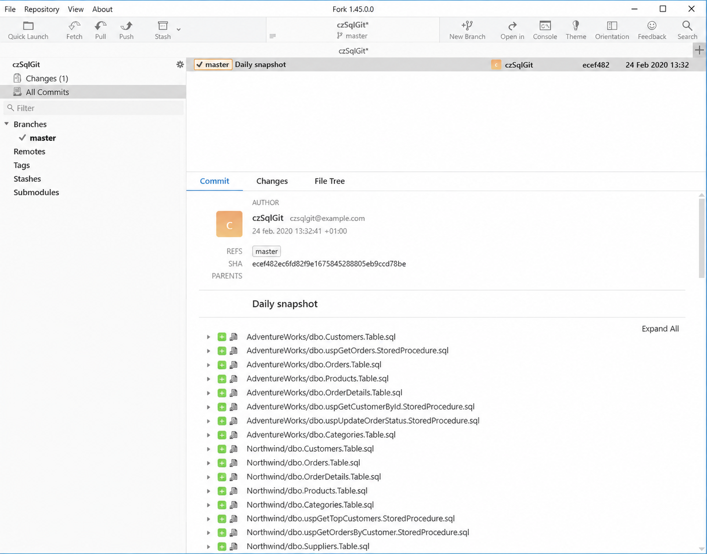

<p align="center"></p>

# czSQLServerGit

**Automatic Git version control for SQL Server schemas. Simple, reliable and under your control.**

**No more unknown schema changes.** Every schema change recorded: what changed, when, and who did it.

How many times have you overwritten or deleted code in SQL Server and needed to undo the change? How many times have you needed the history of every change made to your code or your schema? How many times has a database changed its behaviour and nobody could tell what changed, when, or who did it?

czSQLServerGit records, on the server itself, every creation, modification and deletion of objects in the databases you choose, with no intervention from the developers and no interruptions. Each change goes to a log table and, asynchronously, to a Git commit containing the updated script of the object. **The change is detected and logged inside SQL Server, not in the clients.** You will forget it is installed until the moment you need it.

## Why

- **No more unknown schema changes.** Every `CREATE`, `ALTER` and `DROP` on every table, view, procedure, function, index and trigger is recorded the moment it happens, with the login that ran it, the exact statement and the full definition of the object. Nothing to remember, nothing to enforce: if it ran on the server, it is in the log and in Git.
- **Normalize and secure your development process.** All the power of Git for your schemas: history, diffs, tags, branches, blame. Every object of every database, one file per object, with the standard Git tools you already use. You control the versions of your schemas the same way you control the rest of your source code.
- **Secured schema migration scripts.** `git diff` between two versions of a database is the exact list of every object that changed, with its old and new definition. The migration script comes from that diff, not from memory or from a schema compare run weeks later. Tag each release and the diff between two tags is the release.
- **Control your production environments.** Production servers are rarely as isolated from developers as they should be, and hotfixes happen. With czSQLServerGit every one of them is recorded, attributed and reversible, and a change in behaviour can be traced to a change in schema in seconds.
- **Forget about losing code again.** You won't comment out chunks of code so as not to lose them, and you can drop obsolete objects without fear: everything that ran on the server since the day you installed it is in the log and in Git.
- **Built for volatile environments.** Development servers where several people change procedures and tables all day long. Integration servers. BI and data warehouse environments that replicate structure changes from source systems, where a column renamed upstream lands in staging hours later and breaks the ETL.
- **You will trust it because you will understand it.** Nothing to install that you don't understand: a small utility database, a DDL trigger, two batch files, Git and a script generator from Microsoft. Standard SQL Server features, nothing else.
- **Easily adaptable.** Exclude changes made by specific logins (ETL, replication, BI processes), version some databases in real time and others once a day, add any other files to the same repository.

It does not replace a deployment pipeline or a migrations tool. It sits underneath them, capturing everything they don't: the hotfix done directly in SSMS at 3 am, the `ALTER` run by the vendor, the change replicated from the source system.

## How it works

```
 Developer ──ALTER PROCEDURE──▶ [AdventureWorks]
                                    │ DDL trigger czSQLServerGit_SchemaAudit
                                    ▼
                         czSQLServerGit.dbo.RegisterChange
                            │ INSERT dbo.SchemaLog
                            │ dbo.AsyncExecInvoke ──▶ Service Broker queue dbo.AsyncExecQueue
                            ▼                                   │ dbo.AsyncExecActivated
                   (the ALTER returns                           │ (single reader: no concurrency)
                    immediately)                                ▼
                                    xp_cmdshell save_one_object_changes.bat AdventureWorks dbo uspGetOrders "dev.maria"
                                                                │ mssql-scripter --include-objects dbo.uspGetOrders
                                                                │ git commit --author="dev.maria" -m "AdventureWorks: dbo.uspGetOrders"
                                                                ▼
                                         C:\czSQLServerGit\AdventureWorks\dbo.uspGetOrders.StoredProcedure.sql
```

Two levels of recording:

- **Every single change**: the utility database `czSQLServerGit` receives, from a DDL trigger in each monitored database, every schema change. It records it in `dbo.SchemaLog` (who, when, which statement, object definition) and queues in Service Broker the call to `save_one_object_changes.bat`, which regenerates only that object's script and commits it, **authored by the SQL Server login that made the change**. The developer never waits: the `ALTER` returns immediately and the commit happens in the background, one after another.
- **Full refresh**: `save_changes.bat` regenerates with mssql-scripter the script of every object of every database (one file per object), copies any other code to be versioned and commits whatever changed. Run it by hand the first time (initial commit) and then from the Task Scheduler, at least once a day: it picks up what the trigger does not capture (external files, databases without the trigger, uncovered events) and heals anything the asynchronous chain may have missed.

## What you get

Every change, in the commit log, authored by whoever made it:



The history and diff of any object:



Everything that changed between two versions, ready to become a migration script:



And the same information in a table, queryable from T-SQL, with the full `EVENTDATA()` and the exact statement that was executed:



## Repository contents

```
scripts/
  save_changes.bat                 Full refresh of every database + commit
  save_one_object_changes.bat      Script of a single object + commit (invoked by the trigger)
sql/
  01_create_czSQLServerGit.sql           Utility database: tables, procedures and Service Broker
  02_schema_audit_trigger.sql      DDL trigger to be created in every database to version
  03_xp_cmdshell_proxy_account.sql Optional: proxy credential for xp_cmdshell
docs/images/                       Screenshots
```

## Compatibility

The T-SQL side relies on features that have not changed since SQL Server 2005/2008, so it runs on every current version:

| Component | Available since | Status today |
|---|---|---|
| DDL triggers + `EVENTDATA()` | SQL Server 2005 | Unchanged |
| Service Broker | SQL Server 2005 | Unchanged |
| `xp_cmdshell` | Always | Still present in 2022 and 2025, disabled by default |
| `DECLARE @x TYPE = value` | SQL Server 2008 | — |
| `OBJECT_DEFINITION`, XML `.value()` | SQL Server 2005 | — |

Tested on SQL Server 2017 and 2025; works on **SQL Server 2008 through 2025**, any edition including Express (Service Broker on Express is fine as long as conversations stay inside the instance, and here they stay inside one database).

The real limits are platform, not version:

- **Windows only.** `xp_cmdshell` does not exist on SQL Server on Linux, and the `.bat` scripts are Windows anyway.
- **Not Azure SQL Database / Managed Instance, as is.** Azure SQL Database has neither Service Broker nor `xp_cmdshell`; Managed Instance has Service Broker but not `xp_cmdshell`. SQL Server on an Azure VM works. See [Azure](#azure) for the adapted design.
- **`mssql-scripter` is the weakest piece.** Microsoft has not maintained it for years (last release 2020, Python 3.7–3.9). It still works against 2019/2022 because it uses SMO underneath, but new object types or syntax from 2022/2025 may fail or be skipped. The `.bat` scripts only need *something* that writes one file per object, so it can be replaced by `Export-DbaScript` from [dbatools](https://dbatools.io/) or by `SqlPackage /Action:Extract`.

## Requirements

- SQL Server with Service Broker and `xp_cmdshell` enabled (see [`sql/03_xp_cmdshell_proxy_account.sql`](sql/03_xp_cmdshell_proxy_account.sql)).
- [Git for Windows](https://git-scm.com/downloads).
- [mssql-scripter](https://github.com/microsoft/mssql-scripter/blob/dev/doc/installation_guide.md) (requires Python).
- Optional: a Git GUI client. The screenshots use [Fork](https://git-fork.com/).

## Installation

### 1. Git

Install Git, create the local repository folder and initialise it:

```bat
mkdir C:\czSQLServerGit
cd C:\czSQLServerGit
git init
```



### 2. Git client (optional)

Install Fork (or any other client) with `C:\czSQLServerGit` as the default source folder:



### 3. mssql-scripter

With Python installed and its `Scripts` folder in `PATH`, open `cmd.exe` as administrator and run:

```bat
python -m pip install -U pip
pip install mssql-scripter
```



### 4. SQL Server login

Create a login (`czsqlservergit` in the scripts) with permission to read definitions in every database to be versioned (`VIEW DEFINITION` plus `db_datareader` is enough for mssql-scripter).

### 5. Batch scripts

Copy [`scripts/save_changes.bat`](scripts/save_changes.bat) and [`scripts/save_one_object_changes.bat`](scripts/save_one_object_changes.bat) to `C:\czSQLServerGit` and adjust the configuration block at the top of each one:

```bat
SET REPO_DIR=C:\czSQLServerGit
SET SQL_SERVER=127.0.0.1
SET SQL_USER=czsqlservergit
SET SQL_PASSWORD=<password>
SET MSSQL_SCRIPTER=mssql-scripter
SET GIT="C:\Program Files\Git\cmd\git.exe"
SET GIT_USER_NAME=czSQLServerGit
SET GIT_USER_EMAIL=czsqlservergit@example.com
```

In `save_changes.bat`, add one block per database to be versioned:

```bat
del .\AdventureWorks\*.* /Q
call %MSSQL_SCRIPTER% -S %SQL_SERVER% -U %SQL_USER% -P %SQL_PASSWORD% -d AdventureWorks --exclude-headers --file-per-object --file-path .\AdventureWorks
```

and, to include any other code (ETL scripts, for instance), the matching `xcopy` and `git add` lines:

```bat
xcopy C:\ETL\*.py .\ETL /s /y
call %GIT% add .\ETL\*
```

Running `save_changes.bat` for the first time creates one folder per database with one file per object, and the initial commit:



### 6. Scheduled task

Schedule `save_changes.bat` in the Windows Task Scheduler to run at least once a day, under a user with permissions on `C:\czSQLServerGit`.

### 7. czSQLServerGit database

Run [`sql/01_create_czSQLServerGit.sql`](sql/01_create_czSQLServerGit.sql), preferably as `sa` so that it owns the database (the queue is activated with `EXECUTE AS OWNER`).

If the repository is not in `C:\czSQLServerGit`, adjust the path in `dbo.RegisterChange`. To ignore changes made by specific logins (ETL, replication, BI processes), uncomment and edit the exclusion line at the top of the same procedure.

If running `xp_cmdshell` from Service Broker fails with permission errors (visible in the SQL Server event log or in `dbo.AsyncExecResults`), create the credential `##xp_cmdshell_proxy_account##` with [`sql/03_xp_cmdshell_proxy_account.sql`](sql/03_xp_cmdshell_proxy_account.sql): when it exists, `xp_cmdshell` uses it as its Windows security context.

### 8. Trigger in every database

Run [`sql/02_schema_audit_trigger.sql`](sql/02_schema_audit_trigger.sql) in every database to be monitored. It creates the DDL trigger `czSQLServerGit_SchemaAudit` and, as a test, creates and drops a procedure `czSQLServerGit_Test`: two rows must appear in `czSQLServerGit.dbo.SchemaLog` and two commits in the repository.

## Querying the log

```sql
SELECT Id, UserName, EventType, DatabaseName, SchemaName, ObjectName, ObjectType, CreatedAt, Command
FROM czSQLServerGit.dbo.SchemaLog
ORDER BY Id DESC
```

Status of the asynchronous calls (timings and errors) is in `czSQLServerGit.dbo.AsyncExecResults`.

## Azure

The same idea works on Azure SQL Database and Azure SQL Managed Instance. What changes is the piece that takes the work out of the database, because there is no `xp_cmdshell` in either of them and no Service Broker in Azure SQL Database. **The Azure version will be published in this same repository shortly.**

| | SQL Server | Azure SQL Database | Azure SQL Managed Instance |
|---|---|---|---|
| DDL triggers + `EVENTDATA()` | ✅ | ✅ | ✅ |
| Service Broker | ✅ | ❌ | ✅ |
| `xp_cmdshell` | ✅ | ❌ | ❌ |
| `sp_invoke_external_rest_endpoint` (HTTP calls from T-SQL) | ❌ | ✅ | ❌ |

```
[Azure SQL DB / MI]  DDL trigger czSQLServerGit_SchemaAudit
                          │
                          ▼
                     dbo.SchemaLog  (+ Processed BIT DEFAULT 0)
                          │
                          │  (a) polling: timer every 30-60 s              ← SQL Database and Managed Instance
                          │  (b) push: sp_invoke_external_rest_endpoint    ← SQL Database only, fire-and-forget
                          ▼
                    [Azure Function]
                          │  SELECT ... WHERE Processed = 0 ORDER BY Id   (single instance = MAX_QUEUE_READERS = 1)
                          │  write the object script
                          │  commit "AdventureWorks: dbo.uspGetOrders" as the login that made the change
                          │  UPDATE SchemaLog SET Processed = 1
                          ▼
                     GitHub / Azure Repos
```

- **The trigger and the log table stay the same.** `RegisterChange` only inserts the row; it no longer queues anything.
- **An Azure Function replaces Service Broker, `xp_cmdshell` and the `.bat`.** The `SchemaLog` table itself is the queue: the Function polls it in `Id` order from a single instance, so commits happen in sequence exactly as with `MAX_QUEUE_READERS = 1`, and the `INSERT` stays inside the DDL transaction, so nothing is ever lost. On Azure SQL Database the trigger can additionally push a notification to the Function with `sp_invoke_external_rest_endpoint` (inside a `TRY/CATCH`, so that a network error never fails the developer's `ALTER`); the poller remains as the safety net.
- **No scripting tool needed for most objects.** `SchemaLog.ObjectDefinition` already holds the full `OBJECT_DEFINITION()` of procedures, views, functions and triggers; the Function just writes it to `AdventureWorks/dbo.uspGetOrders.StoredProcedure.sql`. Only tables and indexes need SMO (`Microsoft.SqlServer.SqlManagementObjects`).
- **No Git binary needed either.** The GitHub Contents API (`PUT /repos/{owner}/{repo}/contents/{path}`) or the Azure Repos Pushes API creates one commit per call, with the author of your choice.
- **The full refresh needs nothing on the server**: a scheduled GitHub Actions / Azure DevOps pipeline running `SqlPackage /Action:Extract` or `Export-DbaScript` against the database and committing the result.

## Objects in the czSQLServerGit database

| Object | Description |
|---|---|
| `dbo.SchemaLog` | One row per schema change: user, event, database, schema, object, type, date, definition, executed statement, full `EVENTDATA()` and the command sent to Git. |
| `dbo.AsyncExecResults` | One row per asynchronous call: command, submit/start/finish times and error, if any. |
| `dbo.RegisterChange` | Called by the DDL trigger. Inserts into `SchemaLog` and queues the call to the `.bat`. |
| `dbo.AsyncExecInvoke` | Sends the command to the Service Broker queue and records it in `AsyncExecResults`. |
| `dbo.AsyncExecActivated` | Queue activation procedure: executes the received command and records the outcome. |
| `dbo.AsyncExecQueue` / `AsyncExecService` | Service Broker queue and service, with a single reader so commits happen in order. |

## Roadmap

- Record in `SchemaLog` the machine the change was made from (`HOST_NAME()`).
- `git push` to a remote repository after each commit.
- Cover the remaining schema objects (queues, types, synonyms, schemas...).
- Send each database to a different repository.
- Exclusion table (objects or schemas not to be versioned).
- Verify tags and branches.

## Author

[César Zea](https://www.cesarzea.com) — https://www.cesarzea.com

## License

[MIT](LICENSE) — Copyright (c) 2020-2026 [César Zea](https://www.cesarzea.com). If you use it, keep the copyright notice; if you improve it, a pull request is very welcome.
